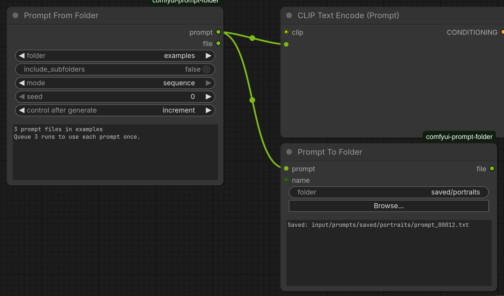

# Prompt Folder

ComfyUI nodes for folders of `.txt` prompts. **Prompt From Folder** loads one prompt,
at random or in sequence, and shows you which prompt it picked. **Prompt To Folder**
saves prompts into those folders.



## Who this is for

- You keep prompts as text files, one per file, and want to work through a
  folder of them: every prompt once, in order, or a random one each run.
- You want to keep the prompts that worked, for example the output of a prompt
  enhancer, and bring them back later as a folder you can loop over.

It works with any model: the output is plain text for a CLIP Text Encode node.

How it differs from other prompt-from-folder packs:

- The node shows how many prompts a folder holds before you run, and which one
  it picked after the run.
- Sequence mode restarts at the first file when you change folder.
- There is a matching node that saves prompts.
- Everything stays inside `ComfyUI/input/prompts/`, with the protections listed
  under [Safety](#safety).

## Read before you run

- **Prompt To Folder writes files.** It creates folders and numbered `.txt`
  files under `ComfyUI/input/prompts/`, on every run. It never overwrites an
  existing file, and nothing is written outside that folder.
- **Your ComfyUI may be reachable from other machines.** If you start ComfyUI
  with `--listen`, anyone who can reach it can use these nodes, like any other
  node. Two small routes, used by the Browse dialog and the file count, also let
  them list the folder names under `input/prompts/`. They can't read or write
  anything outside that folder.

## Prompt From Folder

| Input | What it does |
| --- | --- |
| `folder` | A folder under `ComfyUI/input/prompts/`. Press **R** in ComfyUI to refresh the list after adding folders. |
| `include_subfolders` | Also pick from the folder's subfolders. |
| `mode` | `sequence` takes each file in name order, one per run. `random` is a seeded random pick. |
| `seed` | Sequence: the position in the list (it wraps). Random: the same seed always picks the same file. |

The seed's **control after generate** follows the mode by itself: `sequence`
sets it to *increment* (the next file every run) and `random` to *randomize*.

In `sequence` mode the seed is the position in the list, starting at 0. It goes
back to 0, the first file, whenever you switch the mode to `sequence`, pick
another folder, or toggle `include_subfolders`, so a sequence never starts part
way through a folder. A seed you type in yourself, or one saved in a workflow,
is kept, so you can resume a sequence where you left off. The restart is done
by the ComfyUI frontend. If you drive the node through the API without it, set
`seed` to 0 yourself to start at the first file.

| Output | |
| --- | --- |
| `prompt` | The file's text, ready for a CLIP Text Encode node's `text` input. |
| `file` | The file's path within `input/prompts/`. |

As soon as you pick a folder, before any run, the box on the node shows how
many prompt files it holds, for example "8 prompt files in agerange/african:
queue 8 runs to use each prompt once". The count includes subfolders when
`include_subfolders` is on.

After each run, a box on the node shows the file that was picked, its position
(for example `2 of 12`), and the prompt. The box is display only: it is not sent
with the prompt and is not saved with the workflow.

### Prompt files

- Each `.txt` file holds one prompt.
- Files are read as UTF-8, and leading and trailing whitespace is stripped.
- Names sort naturally, so `2.txt` comes before `10.txt`. Number your files to
  set the order.
- Hidden files and non-`.txt` files are ignored.
- To use a collection stored elsewhere, symlink its folder into
  `input/prompts/`. Symlinked folders are followed, and link loops are skipped.

If you edit a prompt file, the node notices and runs again, even with a fixed
seed.

## Prompt To Folder

Saves a prompt as a numbered `.txt` file, ready for Prompt From Folder to load
later.

| Input | What it does |
| --- | --- |
| `prompt` | The text to save. Connect the same string you send to CLIP Text Encode. |
| `folder` | A folder under `ComfyUI/input/prompts/`. Type a name (a new one is created), or use **Browse…** to pick an existing one. |
| `name` *(optional)* | The file name prefix, numbered like Save Image: `name_00001.txt`, `name_00002.txt`, and so on. A `/` in the name makes subfolders. Defaults to `prompt`. |

It never overwrites a file; it takes the next free number instead. It saves on
every run, even when the prompt has not changed. A box on the node shows where
the last prompt was saved, and the `file` output gives the same path.

Everything is written inside `input/prompts/`:

- `..` is refused.
- Absolute paths such as `/etc` become ordinary subfolders under
  `input/prompts/`.
- Characters that are unsafe in file names, including `:`, become `_`.
- Files are created exclusively and without following symlinks, so a symlink
  planted at the target is never written through.
- The Browse dialog lists only folders under `input/prompts/`.

## Example workflow

`example_workflows/Prompt From Folder - Z-Image Turbo.json` is ComfyUI's standard
**Z-Image Turbo** template, unchanged, with its prompt coming from Prompt From Folder.

1. Copy `example_prompts/` to `ComfyUI/input/prompts/examples/`.
2. Load the workflow and press **R** so the folder list includes `examples`.
3. Run it. In `sequence` mode each run takes the next prompt.

It uses the template's own model files (`z_image_turbo_bf16`, `qwen_3_4b`, `ae`).
Download links are in the workflow's model note.

## Safety

ComfyUI is often reachable from other machines on the network, so the node
only ever lists and reads inside `input/prompts/`:

- A folder value that is not in the current list is rejected, so `../` or
  `/etc` never reach the filesystem.
- Each file is opened without following a symlink at the file itself, without
  blocking (a FIFO cannot hang ComfyUI), and only up to 256 KB.

## Install

Clone it into `custom_nodes`, or use ComfyUI-Manager's **Install via Git URL** with the
repository address:

```bash
cd ComfyUI/custom_nodes
git clone https://github.com/nzkritik/comfyui-prompt-folder
```

Then restart ComfyUI. There are no Python dependencies. The nodes use ComfyUI's
V3 node API, so they need ComfyUI **v0.3.48 or later**. They were developed on
v0.37.0.

Prompt folders live in `ComfyUI/input/prompts/`, which is created on first load.
Put `.txt` files in folders there, or symlink existing folders in.

## Tests

```bash
uvx pytest -q tests                          # the folder/pick/read logic, no ComfyUI needed
python tests/ui_check.py examples sequence 1 # against a running, idle ComfyUI; needs aiohttp
```

`ui_check.py` drives the real frontend in headless Chromium, and blocks writes
to ComfyUI settings.

## Licence

MIT
